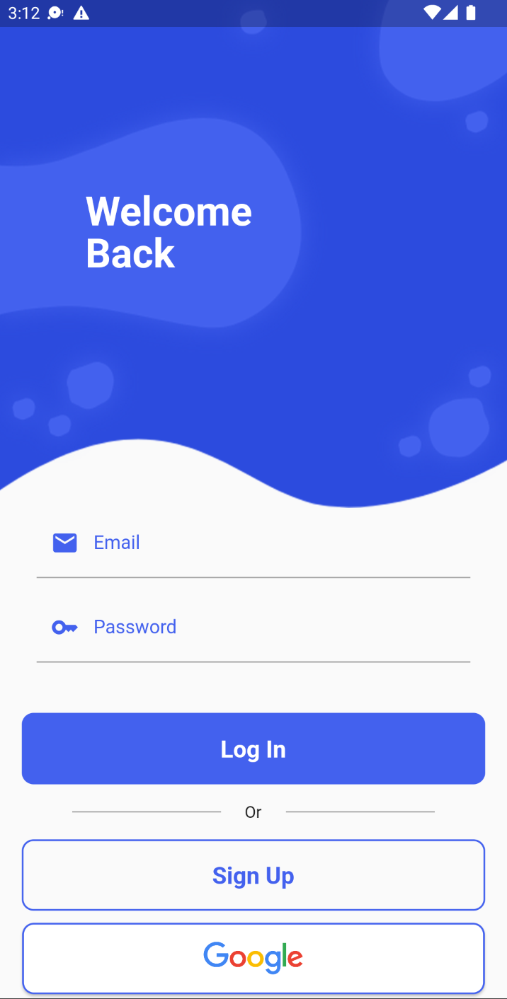
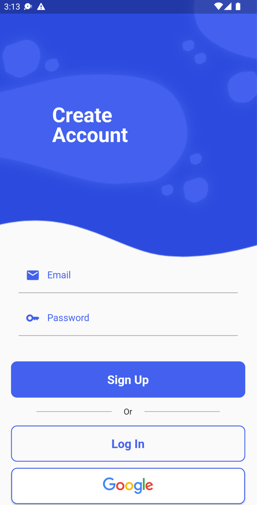
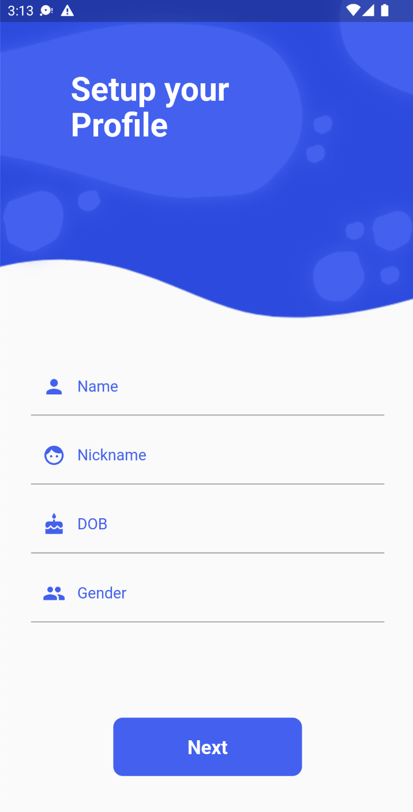
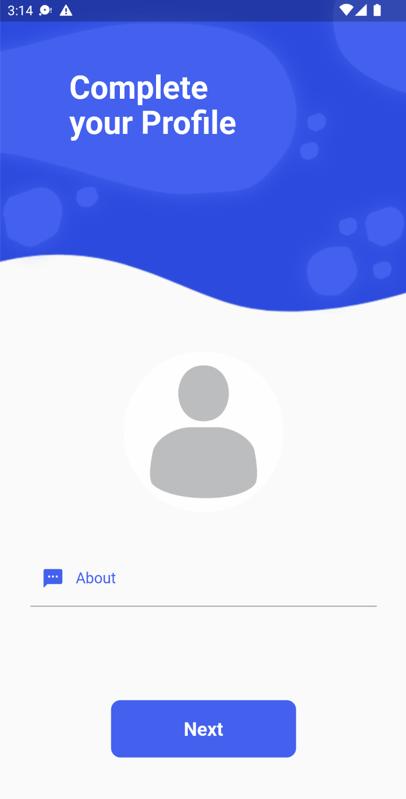
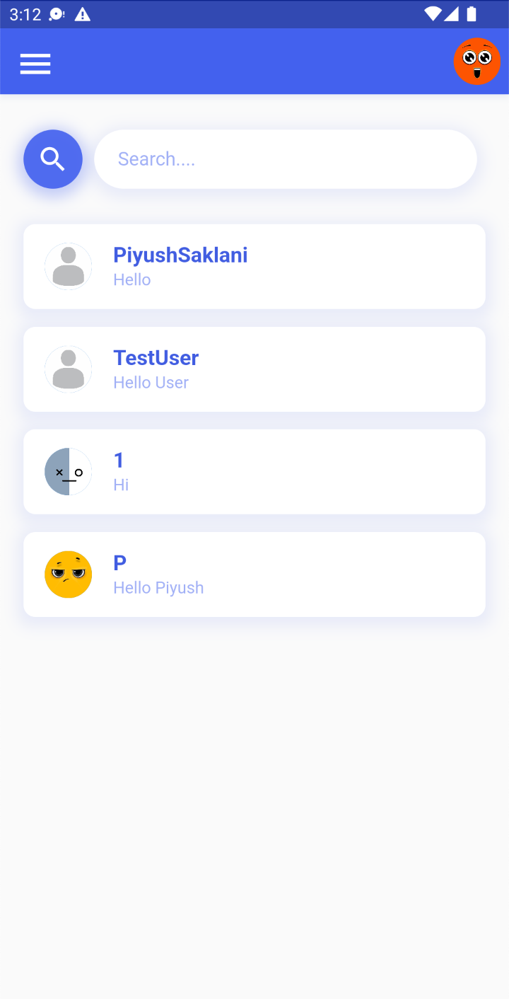
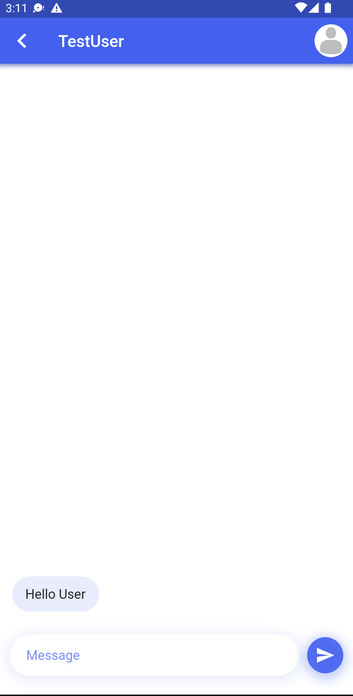
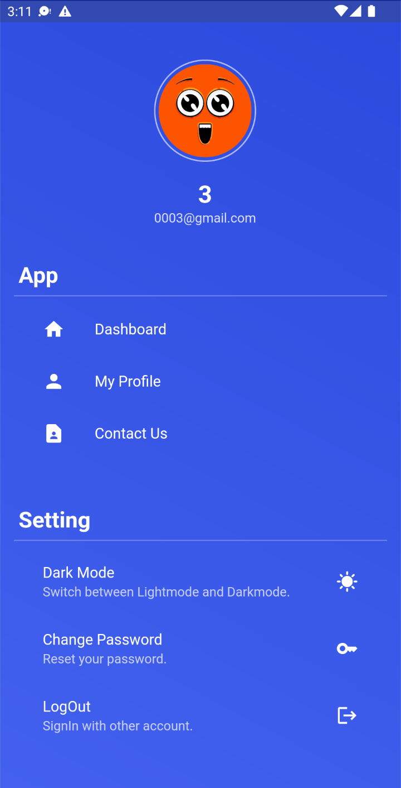
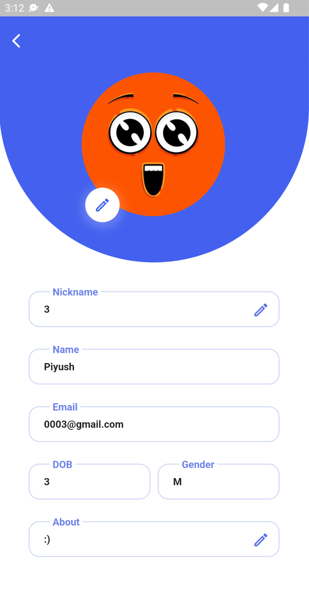

# Talkies

## About

A chat application called Talkies was created with Flutter, and Firebase served as its database. The app allows users to easily connect with their friends and family through real-time messaging, regardless of their location. With a user-friendly interface and intuitive design, Talkies makes it easy for users to stay in touch and share their thoughts, feelings, and ideas.

## Screens

 - **Login screen:** Users can safely access their accounts using the login screen by entering their credentials.
 - **Signup screen:** New users can create an account by entering their email addresses and password.
 - **Menu screen:** Options for managing the user's profile, dashboard, theme preferences, and logout are available.
 - **Dashboard screen:** Displays a list of the user's contacts or ongoing conversations.
 - **Chat screen:** Enables real-time messaging between the user and their selected contact, with chat bubble layout and message timestamps.

## Preview

  
   
  
  

  
  
  
  

